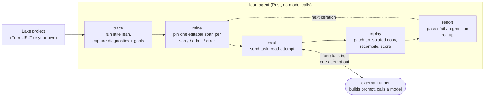

# lean-agent-rs

Rust infrastructure for reproducible Lean 4 proof tracing and theorem-agent evaluation.

`lean-agent-rs` is the boring-but-load-bearing layer under AI proof experiments: it runs Lean files the same way every time, turns failures into a dataset, hands those tasks to a model-agnostic runner, replays the answers against an isolated copy of the project, and scores what changed. Most proof experiments break at reproducibility before they break at intelligence, and this is the substrate that keeps the reproducibility honest.

It is not a theorem prover and not a replacement for LeanDojo. The niche is a Rust-native, CLI-first loop for Lean agent experiments, driven against real projects like [FormalSLT](https://github.com/Robby955/FormalSLT) and your own Lake packages.

## Install

```bash
cargo install lean-agent        # the `lean-agent` binary
cargo add lean-agent-core       # the library, to build your own tooling
```

The stages call `lake lean` inside a `--lake-root`, so a working Lean 4 / Lake toolchain is required for `trace`, `mine --kind error`, and `replay`; the parsing and packaging stages run without one.

## The loop



Each stage reads and writes JSONL, so a run is a chain of files you can inspect, diff, and re-feed. The dotted arrow is the point: `report` tells you which spans are still open, and those go back into the next `mine`/`eval` pass.

A full pass against a small Lake project:

```bash
# 1. trace: run Lean over the project, capture diagnostics and goal states.
lean-agent trace . --recursive --lake-root . --out trace.jsonl

# 2. mine: pin one editable span per sorry/admit/error into replayable tasks.
lean-agent mine . --lake-root . --kind sorry --out tasks.jsonl

# 3. eval: hand each task to a runner over stdin/stdout, collect attempts.
lean-agent eval tasks.jsonl --runner ./scripts/echo_runner.sh --lake-root . --out attempts.jsonl

# 4. replay: apply each attempt to an isolated copy and recompile.
lean-agent replay attempts.jsonl --lake-root . --out results.jsonl

# 5. report: summarize pass/fail/regression counts.
lean-agent report trace.jsonl
```

(The CLI binary is `lean-agent`; from source, run any command with `cargo run -p lean-agent -- <command>`.)

## Stage by stage

### trace: project to diagnostics

`trace` runs `lake lean <file>` per file inside `--lake-root`, then parses stdout/stderr into structured diagnostics with severity, line/column, and a recovered goal state when Lean prints one. Timeouts and spawn failures become `timed_out`/`runner_error` records instead of dropped errors, and every record carries Lean, Lake, and Git versions so it stays reproducible on its own.

```bash
lean-agent trace MyFile.lean --lake-root . --out trace.jsonl
lean-agent trace . --recursive --lake-root . --out all.jsonl --only-failures
lean-agent trace --config lean-agent.toml --out all.jsonl   # defaults from config; flags win
```

### context: one line to a paste-ready prompt

`context` replaces hand-copying imports, the enclosing declaration, the compiler errors, and the goal state into a chat prompt. Given `FILE.lean:LINE`, it reads the source, optionally traces the file once, and emits a bundle (JSON or Markdown) with a ready-to-paste prompt.

```bash
lean-agent context MyFile.lean:42 --lake-root . --out context.json
lean-agent context MyFile.lean:42 --format markdown --out context.md
lean-agent context MyFile.lean:42 --no-trace   # static bundle, skips running Lean
```

### mine: diagnostics to replayable tasks

`mine` pins one precise span the agent may rewrite. Placeholder mining (`sorry`, `admit`) is a text scan that skips comments and string literals, so it needs no toolchain; error mining runs the file through the tracer, so its tasks are backed by real diagnostics. Every task is a single-span, single-file edit where `source_before + target_span.text + source_after` reproduces the file byte for byte.

```bash
lean-agent mine . --lake-root . --kind sorry --out tasks.jsonl
lean-agent mine . --lake-root . --kind admit --out tasks.jsonl
lean-agent mine . --lake-root . --kind error --out tasks.jsonl
lean-agent mine . --recursive --kind sorry --out tasks.jsonl
```

### eval: tasks to attempts (the decoupled runner contract)

`eval` is the agent stage, and it is deliberately split from any model. `lean-agent` never calls a model API; it talks to a runner you supply over a line-oriented process contract:

- input is the mined task file (one task per line) from `mine`;
- the runner is spawned once and read in lock step: `eval` writes one task JSON line to its stdin, flushes, then reads exactly one attempt JSON line from its stdout before sending the next task (blank lines are ignored);
- each reply is `{task_id, attempt_id, replacement, model?, prompt_hash?, metadata?}`;
- `eval` merges the reply with the task (editable span, target file, and backing diagnostic come from the task; proof text and provenance come from the reply) into a replayable attempt;
- `prompt_hash` falls back to a SHA-256 of the sent task line when the runner omits it, so every attempt is reproducible;
- the lake root is passed to the runner in the `LEAN_AGENT_LAKE_ROOT` environment variable;
- a per-task reply timeout (`--timeout`) stops a stuck runner.

```bash
lean-agent eval tasks.jsonl --runner ./scripts/echo_runner.sh --lake-root . --out attempts.jsonl
```

This split keeps `lean-agent-core` model-free and lets the runner be a Python script, a shell wrapper, or anything that reads a line and writes a line. A real runner builds a prompt from the task fields (imports, the enclosing declaration, the goal state) and calls a model; the included `scripts/echo_runner.sh` is a wiring stub that returns a fixed replacement so the pipeline can be tested end to end.

A minimal runner in shell:

```sh
#!/usr/bin/env sh
while IFS= read -r task; do
  # build a prompt from "$task", call your model, then emit one attempt line:
  printf '{"task_id":"%s","attempt_id":"a1","replacement":"  rfl","model":"my-model"}\n' \
    "$(printf '%s' "$task" | sed -n 's/.*"task_id":"\([^"]*\)".*/\1/p')"
done
```

### replay: attempts to scores

`replay` copies the Lake project into a throwaway workspace, applies the one span, runs `lake lean` on the target file, and scores the outcome against an unpatched baseline. The source of truth is never touched.

```bash
lean-agent replay attempts.jsonl --lake-root . --out results.jsonl
lean-agent replay attempts.jsonl --keep-workdir       # leave each copy on disk
lean-agent replay attempts.jsonl --allow-multi-file   # permit edits across files
lean-agent replay attempts.jsonl --no-baseline        # skip the unpatched compare
```

By default an attempt is one span in one file; edits that escape the workspace, fall outside the file, or touch a second file are refused (status `patch_refused`) unless `--allow-multi-file` is set. Each result reports `status`, `compile_passed`, `accepted`, `diagnostic_count`, `new_errors`, `resolved_original_error`, `regression`, and `elapsed_ms`, plus `final_goal_state` when Lean exposes one. With a baseline, `new_errors` counts only errors the patch introduced and `regression` is true when that count is positive.

A passing `lake lean` exit code is not enough on its own: an attempt can weaken the statement, leave a `sorry`, or pin a stray axiom and still exit 0. So a clean compile is run through an accept predicate before it counts as `passed`. A compile that passes the guards is `accepted` and `passed`; one that compiles but fails a guard is `rejected`, with the failing guard recorded under `reject_reason` and the full per-guard outcome under `guards`. The live guards:

1. STATEMENT-UNCHANGED. The declaration signature (everything up to the `:=` that opens the proof body) must be byte-identical before and after the edit, so an attempt cannot pass by quietly weakening what it claims to prove.
2. AXIOM-WHITELIST. After a passing compile, `#print axioms <decl>` must report a subset of `{propext, Classical.choice, Quot.sound}`; a `sorry` warning or any extra axiom (such as `sorryAx`) is a rejection. The axiom set is read from a probe bracketed by per-run sentinels, so a top-level `#eval` in the edited file cannot forge the result, and an anonymous `example` is aliased to a named probe rather than skipped.
3. REVERSE-DEP. `lake build` of the edited module (and its direct importers when they are cheap to find) must succeed, so a weakened shared lemma cannot stay green on a stale olean.

A fourth guard, NEGATIVE-CONTROL (compile the formal negation and require it to fail, so a vacuous claim is caught), is wired but stubbed pending the claim manifest (`TODO(loop-phase)`). Replay recompiles only the edited file and restores dependency oleans with `lake exe cache get` on mathlib-backed projects, so an attempt with all guards stays fast (under a second on a small project; `--no-reverse-dep` and `--no-cache-get` turn off those steps).

These guards address the known bypass classes above (statement-weakening, `sorry`/`admit`, and extra-axiom passes); they are not a proof of soundness. To keep the axiom probe trustworthy, the accept predicate assumes the edit is a proof body: a replacement that introduces a top-level command (`#eval`, `#print`, `import`, `set_option`, `macro`, `elab`, `open`) is refused at patch time (status `patch_refused`).

### report: scores to a roll-up

`report` reads trace JSONL and prints pass/fail/timeout counts, error and warning totals, and the most common first-line messages.

```bash
lean-agent report trace.jsonl
```

## Configuration

`lean-agent.toml` is loaded only when `--config` is passed; CLI flags win over it.

```toml
[project]
name = "my-lean-project"
lake_root = "."
source_roots = ["MyProject"]   # traced when no PATH is given on the command line
exclude = [".lake/"]           # path substrings skipped during discovery

[trace]
timeout_secs = 60
keep_raw_output = false
include_warnings = true
only_failures = false
```

## Schemas

JSON Schemas for the on-disk record types live in [`crates/lean-agent-core/schemas/`](crates/lean-agent-core/schemas/): `trace_record`, `mine_task`, `attempt`, `runner_response`, `replay_result`, and `eval_result`. They ship inside the `lean-agent-core` crate and document the contract between stages and between `eval` and any runner.

## What v0.2.x does vs TODO

Done and exercised against a real Lake project:

- [x] `trace`: `lake lean` execution, JSONL records, first-pass diagnostic parser, timeout/runner-error records, per-record Lean/Lake/Git versions.
- [x] `lean-agent.toml` config with CLI override.
- [x] `context FILE.lean:LINE` bundle (JSON and Markdown).
- [x] `mine`: sorry/admit placeholder tasks and error tasks, each a single editable span.
- [x] `eval`: line-oriented runner contract, attempt merge, prompt-hash fallback. Rust calls no model.
- [x] `replay`: deterministic single-span patching into an isolated copy, baseline comparison, regression scoring, and an accept predicate (statement-unchanged, axiom-whitelist, reverse-dependency build) that turns a clean compile into a checked `accepted`/`rejected` verdict.
- [x] `report`: pass/fail/diagnostic roll-up.
- [x] Snapshot tests for diagnostic parsing, sorry mining, context extraction, and patch application.

Not done yet (searchable `TODO(...)` tags in code):

- [ ] Parquet output and a dataset manifest.
- [ ] Per-task artifact directory and cost/latency accounting in `eval`.
- [ ] Bounded parallel execution across files and attempts.
- [ ] More real Lean diagnostic fixtures and a hardened goal-state parser.
- [ ] `lake serve` / LSP for interactive goal states beyond diagnostics.
- [ ] Tactic-state extraction and declaration-level attribution.

## Rust quality bar

- library-first: `lean-agent-core` holds the reusable logic, `lean-agent` is a thin CLI;
- typed domain objects: `LeanFile`, `GoalState`, `DiagnosticSeverity`, `FileStatus`, `MineTask`, `Attempt`;
- stable serialized schemas under `crates/lean-agent-core/schemas/`;
- `thiserror` in the library, `anyhow` only in the CLI;
- no `unsafe`, no hidden panics in library code (`unwrap`/`expect`/`panic` are clippy-denied);
- snapshot tests for the artifact shapes;
- `cargo fmt`, `cargo clippy`, `cargo test`, `cargo deny` in CI;
- dual MIT/Apache-2.0 license.

## Development

```bash
cargo fmt --all
cargo clippy --workspace --all-targets --all-features -- -D warnings
cargo test --workspace

# trace/mine/error-mining/replay run `lake lean` inside --lake-root, so point them at a real Lake project:
cargo run -p lean-agent -- trace path/to/Project/Some.lean --lake-root path/to/Project --out trace.jsonl
cargo run -p lean-agent -- report trace.jsonl
```

Snapshot tests live in `crates/lean-agent-core/tests/snapshot_tests.rs` with fixtures under `crates/lean-agent-core/tests/fixtures/`; they run without Lean. Diagnostic parsing is also exercised by the fixture test in `crates/lean-agent-core/src/diagnostics.rs`.

## TODO-stub policy

TODOs are explicit and searchable, each with a milestone tag and a clear "done" condition:

```rust
// TODO(lsp-v0.4): add lake serve integration for interactive goal states.
// TODO(parser-hardening): snapshot-test real mathlib diagnostic fixtures.
// TODO(eval-artifacts): write a per-task artifact directory with cost/latency.
```
